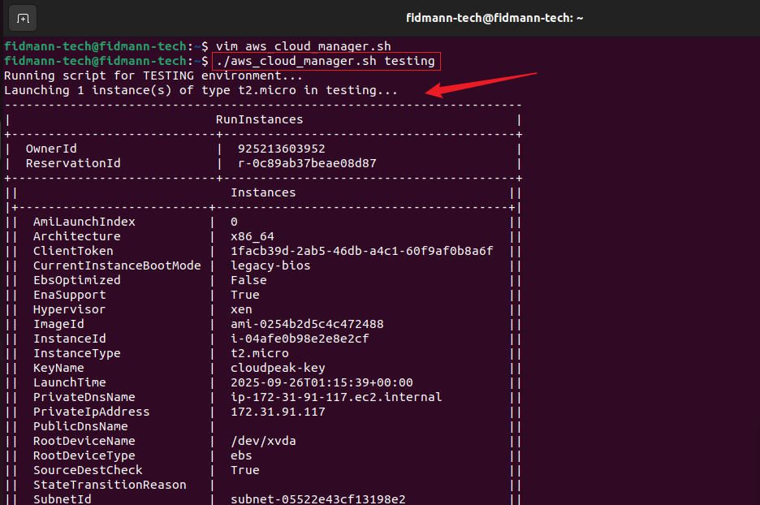
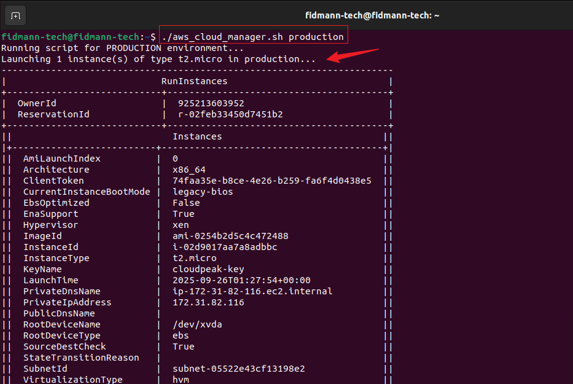
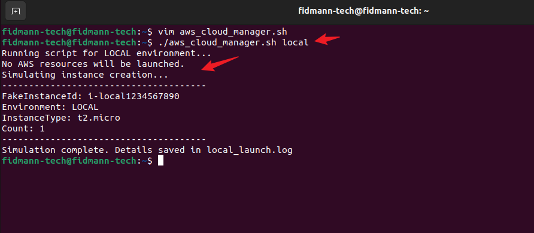
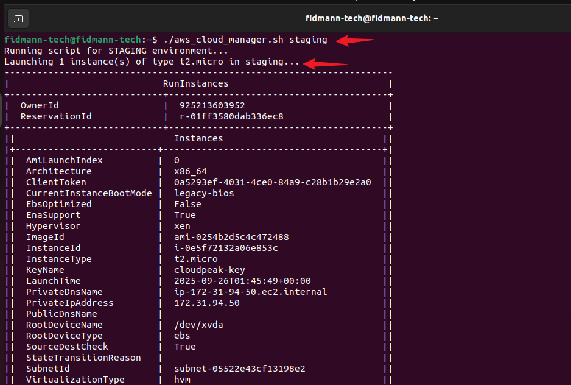
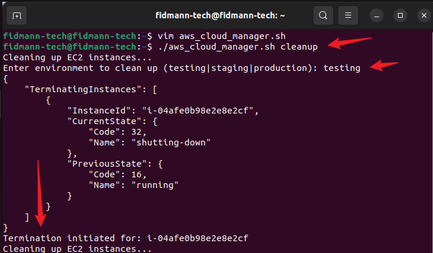
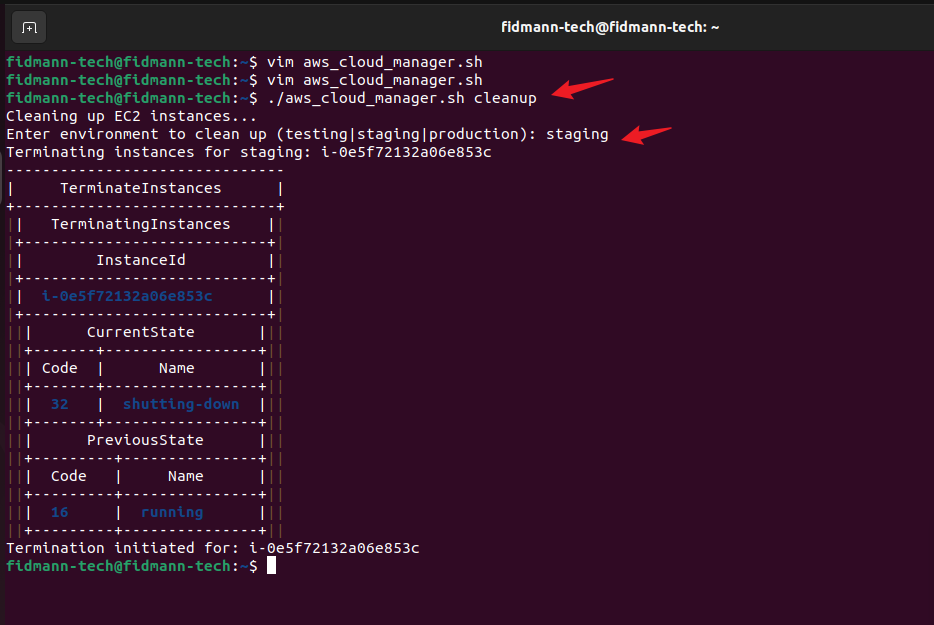
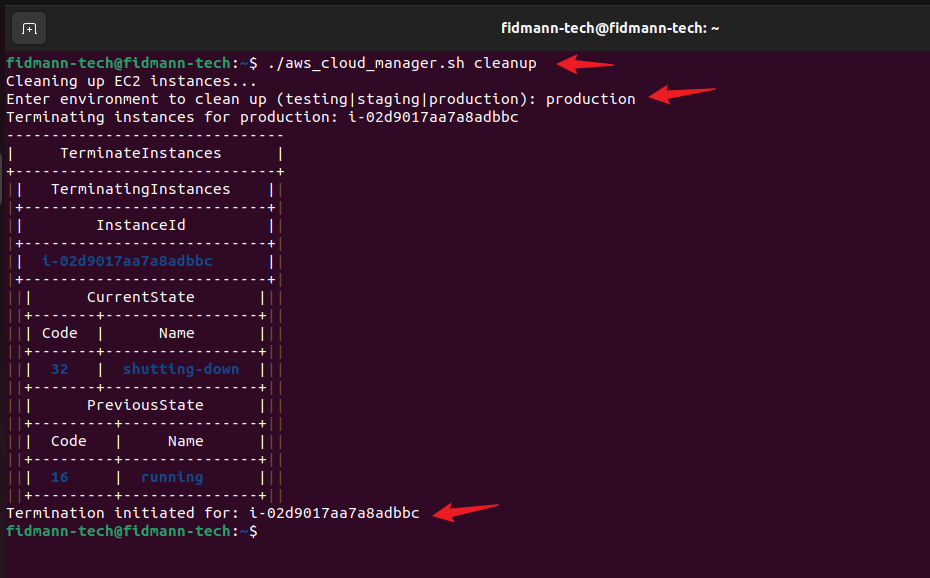

## AWS Cloud Manager Script – Managing Environments with Shell Scripting
📌 Introduction

This mini project demonstrates how to use environment variables and positional parameters in shell scripting to dynamically manage different infrastructure environments (local, testing, staging, and production). Instead of hardcoding values, we make the script flexible by passing arguments at runtime.

The script also supports a cleanup option to terminate test/staging/production instances, ensuring good resource management.
The script helps illustrate the difference between:
Infrastructure environments (local development, AWS testing account, AWS staging account, AWS production account).

Environment variables (key-value pairs like DB_URL, DB_USER, DB_PASS that control how an application runs in each environment).

## 🧠 Concepts Learned

Difference between infrastructure environments and environment variables.
How to set environment variables using export.
Why hardcoding values inside scripts is a poor practice.
Using positional parameters ($1, $2, etc.) to pass arguments dynamically.
Adding defaults (e.g., default to t2.micro and 1 instance if not provided).
Validating script input with argument checks ($#, -lt) to ensure correct usage.
Managing multiple environments including local, testing, staging, production, and cleanup.
Writing safe logic for local (fake logs, no AWS calls) to avoid costs.
Importance of screenshots to demonstrate proof of execution in each environment.

## ⚙ Prerequisites

Linux terminal (Ubuntu on VirtualBox or WSL).
Basic shell scripting knowledge.
AWS CLI installed and configured with credentials.
Free-tier AWS account (script uses t2.micro only).

🚀 Script Usage

Make the script executable first:

chmod +x aws_cloud_manager.sh

Run the script with arguments:
./aws_cloud_manager.sh <environment> [instance_type] [instance_count]

Examples:

./aws_cloud_manager.sh local
./aws_cloud_manager.sh testing t2.micro 1
./aws_cloud_manager.sh staging t2.micro 2
./aws_cloud_manager.sh production t2.micro 1
./aws_cloud_manager.sh cleanup

## 🛠 Evolution of the Script
### 1. Hardcoding Environment Variable

Initially, the script was written with the environment variable hardcoded inside:
```bash
#!/bin/bash
ENVIRONMENT="testing"
if [ "$ENVIRONMENT" == "local" ]; then
  echo "Running script for Local Environment..."
elif [ "$ENVIRONMENT" == "testing" ]; then
  echo "Running script for Testing Environment..."
elif [ "$ENVIRONMENT" == "production" ]; then
  echo "Running script for Production Environment..."
fi
```
📌 Limitation: Always runs in testing because the value is fixed.

### 2. Using export to Set Environment Variable

We then used export to set environment variables dynamically in the terminal:

export ENVIRONMENT=production
./aws_cloud_manager.sh

Output:

Running script for Production Environment...

### 3. Using Positional Parameters

We improved the script by allowing arguments to be passed directly when executing:

./aws_cloud_manager.sh local
./aws_cloud_manager.sh testing
./aws_cloud_manager.sh production


📌 Benefit: Cleaner and easier — no need for export.

### 4. Final Improved Script

## The final script introduces:

Local environment with fake logs (no charges).
Testing, staging, production: launch real EC2 instances (t2.micro only).

Cleanup option to terminate instances.

Flexible parameters: [instance_type] [instance_count] with defaults.
```bash
#!/bin/bash

# ========================================
# aws_cloud_manager.sh
# A dynamic AWS CLI automation script
# Supports multiple environments and scaling options
# ========================================

# --- Argument Validation ---
if [ "$#" -lt 1 ]; then
  echo "Usage: $0 <environment> [instance_type] [instance_count]"
  echo "Example: $0 testing t2.micro 2"
  exit 1
fi

# --- Positional Parameters ---
ENVIRONMENT=$1
INSTANCE_TYPE=${2:-t2.micro}      # Default to t2.micro if not provided
INSTANCE_COUNT=${3:-1}            # Default to 1 if not provided

# --- Common Variables (replace with your own values) ---
AMI_ID="ami-xxxx"    # Replace with a valid AMI
KEY_NAME="my-key"    # Replace with your EC2 key pair
SECURITY_GROUP="sg-xxxx" # Replace with your SG ID
SUBNET_ID="subnet-xxxx"  # Replace with your subnet ID

# --- Function to Launch EC2 ---
launch_instance () {
  echo "Launching $INSTANCE_COUNT instance(s) of type $INSTANCE_TYPE in $ENVIRONMENT..."
  aws ec2 run-instances \
    --image-id $AMI_ID \
    --count $INSTANCE_COUNT \
    --instance-type $INSTANCE_TYPE \
    --key-name $KEY_NAME \
    --security-group-ids $SECURITY_GROUP \
    --subnet-id $SUBNET_ID \
    --tag-specifications "ResourceType=instance,Tags=[{Key=Environment,Value=$ENVIRONMENT}]" \
    --output table | tee ${ENVIRONMENT}_launch.log
  echo "Instance(s) launched for $ENVIRONMENT. Details saved in ${ENVIRONMENT}_launch.log"
}

# --- Function to Cleanup (Terminate) EC2 ---
cleanup_instance () {
  INSTANCE_IDS=$(aws ec2 describe-instances \
    --filters "Name=tag:Environment,Values=$ENVIRONMENT" "Name=instance-state-name,Values=running" \
    --query "Reservations[].Instances[].InstanceId" --output text)
  if [ -z "$INSTANCE_IDS" ]; then
    echo "No running instances found for $ENVIRONMENT."
  else
    echo "Terminating instances for $ENVIRONMENT: $INSTANCE_IDS"
    aws ec2 terminate-instances --instance-ids $INSTANCE_IDS --output table
  fi
}

# --- Main Logic ---
case $ENVIRONMENT in
  local)
    echo "Running script for LOCAL environment..."
    echo "No AWS resources will be launched."
    echo "Simulating fake instance log for local testing..."
    echo "FakeInstanceId: i-local1234567890
Environment: LOCAL
InstanceType: $INSTANCE_TYPE
Count: $INSTANCE_COUNT" > local_launch.log
    ;;
  testing|staging|production)
    echo "Running script for $ENVIRONMENT environment..."
    launch_instance
    ;;
  cleanup)
    echo "Cleaning up EC2 instances..."
    cleanup_instance
    ;;
  *)
    echo "Invalid environment. Use: local | testing | staging | production | cleanup"
    exit 2
    ;;
esac
```

### ✅ Sample Outputs
Local
$ ./aws_cloud_manager.sh local
Running script for LOCAL environment...
No AWS resources will be launched.
Simulating fake instance log for local testing...

### Testing
$ ./aws_cloud_manager.sh testing
Running script for TESTING environment...
Launching 1 instance(s) of type t2.micro in testing...

### Staging
$ ./aws_cloud_manager.sh staging t2.micro 2
Running script for STAGING environment...
Launching 2 instance(s) of type t2.micro in staging...

### Production
$ ./aws_cloud_manager.sh production
Running script for PRODUCTION environment...
Launching 1 instance(s) of type t2.micro in production...

### Cleanup EC2 instances for an environment:

./aws_cloud_manager.sh cleanup
You will be prompted:
Enter environment to clean up (testing|staging|production):

## Conclusion
In this mini project, I learned the clear distinction between infrastructure environments (local, testing, staging, and production setups in different AWS accounts) and environment variables (key-value pairs controlling software behavior dynamically). By starting with simple scripts, I saw how environment variables can be set externally with export or hardcoded inside a script, but the better practice is to use positional parameters for flexibility (e.g., ./aws_cloud_manager.sh testing).
I also extended the script to support different environments safely, ensured local runs cost-free with fake logs, and added cleanup logic to terminate instances. Finally, I practiced validating inputs, scaling instances, and capturing screenshots as proof of execution. Altogether, this improved version demonstrates professional DevOps scripting practices for managing cloud infrastructure.

## Below are screenshots of workflow of this mini project:









