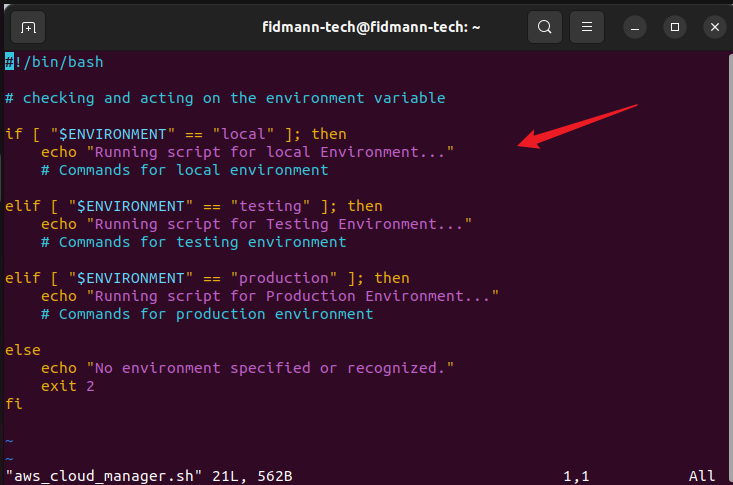
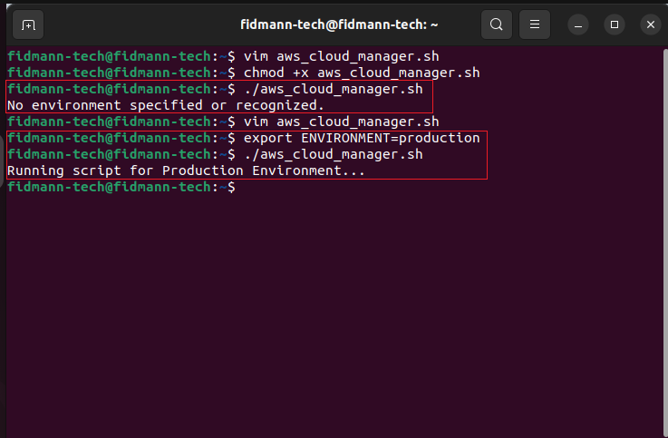
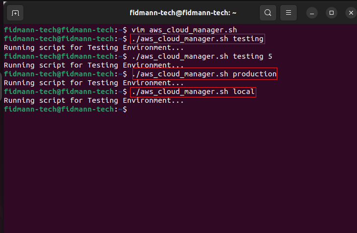
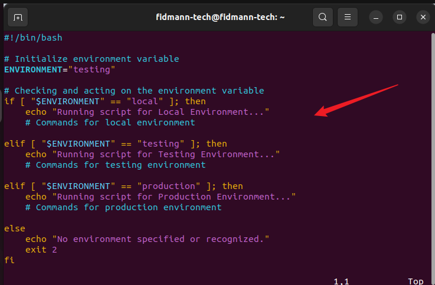
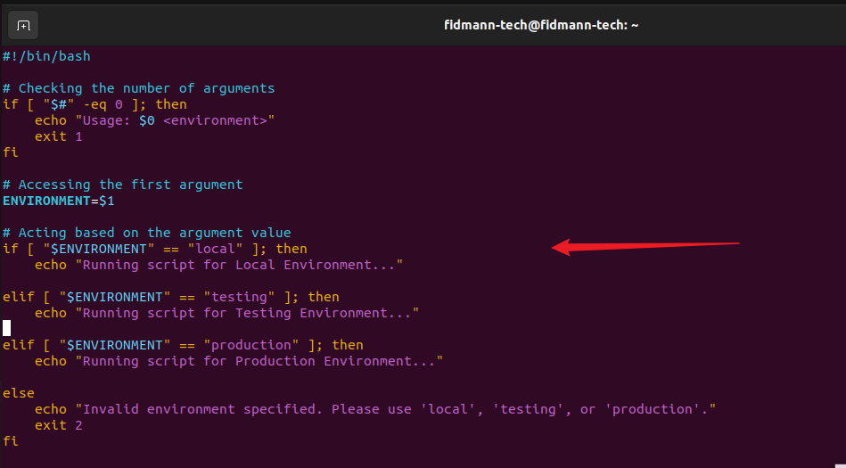
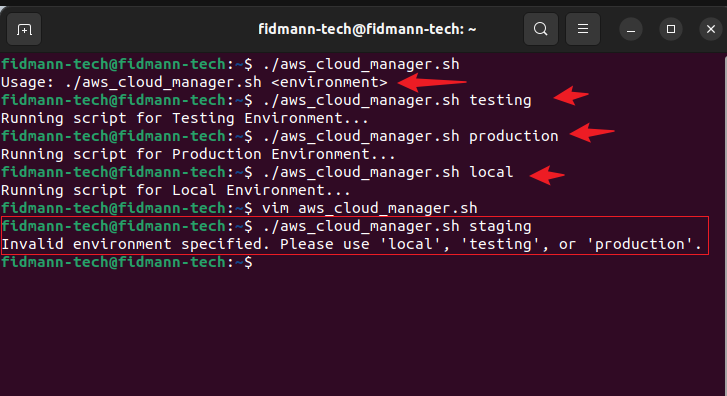

# AWS Cloud Manager Script – Managing Environments with Shell Scripting

## 📌 Introduction
This mini project demonstrates how to use *environment variables* and *positional parameters* in shell scripting to dynamically manage different infrastructure environments (local, testing, and production). Instead of hardcoding values, we make the script flexible by passing arguments at runtime.  

The script helps illustrate the difference between:
- *Infrastructure environments* (local development, AWS testing account, AWS production account).  
- *Environment variables* (key-value pairs like DB_URL, DB_USER, DB_PASS that control how an application runs in each environment).  


## 🧠 Concepts Learned
- Difference between *infrastructure environments* and *environment variables*.  
- How to set environment variables using export.  
- Why *hardcoding values* inside scripts is a poor practice.  
- Using *positional parameters* ($1, $2, etc.) to pass arguments dynamically.  
- Validating script input with argument checks ($#, -ne) to ensure correct usage.  


## ⚙ Prerequisites
- Linux terminal (Ubuntu on VirtualBox or WSL).  
- Basic shell scripting knowledge.  
- AWS CLI installed (optional, for future automation).  


## 🚀 Script Usage
Make the script executable first:
```bash
chmod +x aws_cloud_manager.sh
```
## ## 🛠 Evolution of the Script

### 1. Hardcoding Environment Variable
Initially, the script was written with the environment variable hardcoded inside:
```bash
#!/bin/bash
ENVIRONMENT="testing"

if [ "$ENVIRONMENT" == "local" ]; then
  echo "Running script for Local Environment..."
elif [ "$ENVIRONMENT" == "testing" ]; then
  echo "Running script for Testing Environment..."
elif [ "$ENVIRONMENT" == "production" ]; then
  echo "Running script for Production Environment..."
fi
```
📌 Limitation: Always runs in testing because the value is fixed.

## 2. Using export to Set Environment Variable

Next, we learned that environment variables can be set dynamically in the terminal:

export ENVIRONMENT=production
./aws_cloud_manager.sh


Output:

Running script for Production Environment...


Screenshot:


📌 Improvement: More flexible, but still requires setting variables manually before running.

## 3. Using Positional Parameters

Finally, we improved the script by allowing arguments to be passed directly when executing:

./aws_cloud_manager.sh local
./aws_cloud_manager.sh testing
./aws_cloud_manager.sh production


📌 Benefit: Cleaner and easier — no need for export.

### 🚀 Final Script Usage

Make the script executable first:

chmod +x aws_cloud_manager.sh


Run the script with an argument for the environment:

./aws_cloud_manager.sh local
./aws_cloud_manager.sh testing
./aws_cloud_manager.sh production


If no or wrong arguments are provided:

./aws_cloud_manager.sh
# or
./aws_cloud_manager.sh staging


The script will print usage instructions or an error message.

## 📝 Final Script
```bash
#!/bin/bash

# Checking the number of arguments
if [ "$#" -ne 1 ]; then
  echo "Usage: $0 <environment>"
  exit 1
fi

# Accessing the first argument
ENVIRONMENT=$1

# Acting based on the argument value
if [ "$ENVIRONMENT" == "local" ]; then
  echo "Running script for Local Environment..."
elif [ "$ENVIRONMENT" == "testing" ]; then 
  echo "Running script for Testing Environment..."
elif [ "$ENVIRONMENT" == "production" ]; then 
  echo "Running script for Production Environment..."
else 
  echo "Invalid environment specified. Please use 'local', 'testing', or 'production'."
  exit 2
fi
```

### ✅ Sample Output
$ ./aws_cloud_manager.sh local
Running script for Local Environment...

$ ./aws_cloud_manager.sh testing
Running script for Testing Environment...

$ ./aws_cloud_manager.sh production
Running script for Production Environment...

$ ./aws_cloud_manager.sh staging
Invalid environment specified. Please use 'local', 'testing', or 'production'.


## 🏁 Conclusion

In this mini project, I learned the clear distinction between infrastructure environments (local, testing, production setups in different AWS accounts) and environment variables (key-value pairs controlling software behavior dynamically). By starting with simple scripts, I saw how environment variables can be set either externally with export or hardcoded within a script, but the better practice is to make scripts flexible by using positional parameters to pass arguments at runtime (e.g., ./aws_cloud_manager.sh testing). I also explored how positional parameters like $1, $2, etc., represent arguments passed to a script, allowing dynamic configuration such as environment type or number of EC2 instances. Finally, I learned the importance of validating script input, such as checking the number of arguments provided, to ensure correct usage and avoid errors. Altogether, this exercise demonstrated how environment awareness, environment variables, and shell scripting practices work together to create reusable, reliable, and dynamic automation for managing cloud infrastructure.

## Below are screenshots of hands-on experience on this project:






